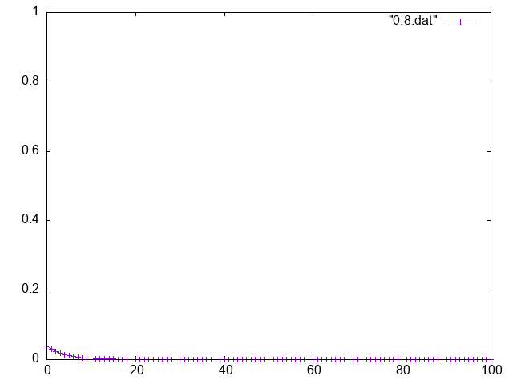
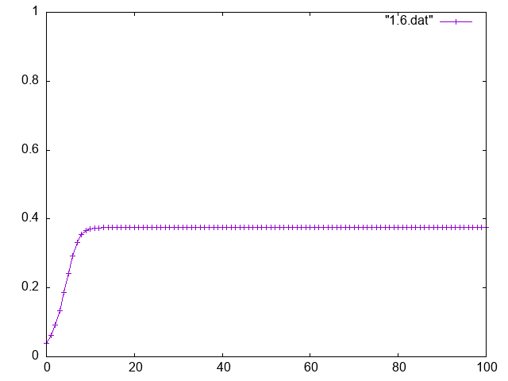
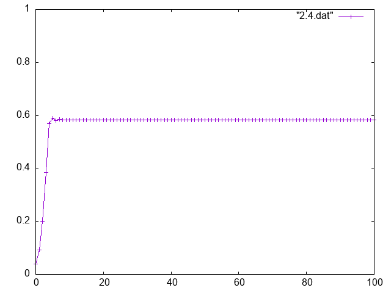
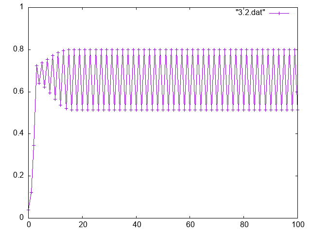
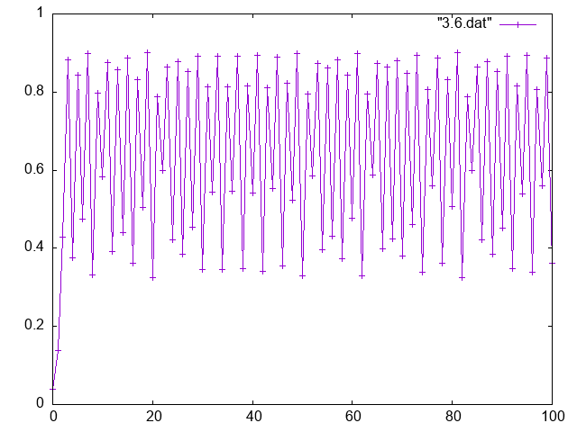
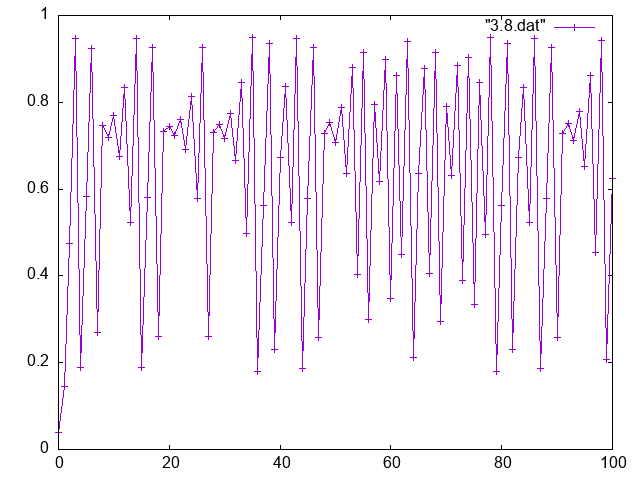
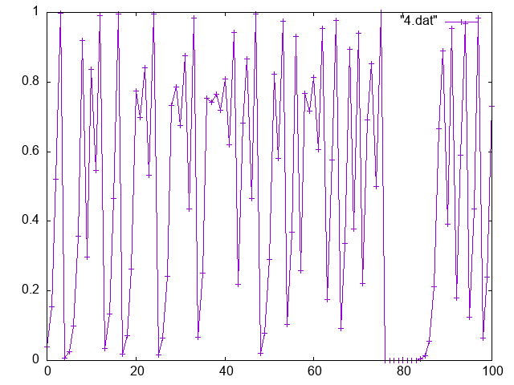
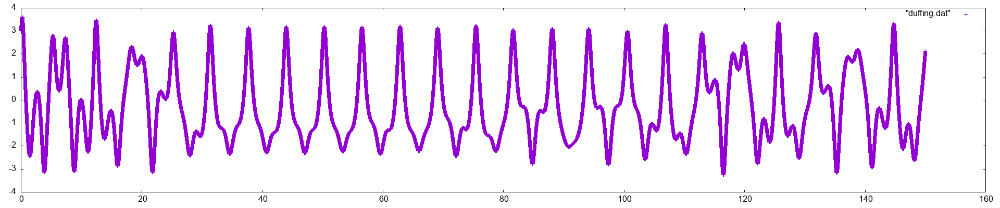

# カオス

とりあえず、メモ書き程度に書きます。

## カオスとは

厳密な方程式に従う現象であっても、長時間の振る舞いが予測不可能なものを一般に**カオス**と呼ぶ。

また、似た初期値をとっても、時間が経つにつれ、全く違う振る舞いをすることをカオスの**初期値鋭敏性**または**バタフライ効果**と呼ぶ。

もっぱら、非線型方程式で見られる。線型方程式

## カオスの具体例

### 写像
- ロジスティック写像　logistic map

### 力学系
- 二重振り子
- ダフィング方程式　

## TODO

- ロジスティック写像の相図を書く
- ルンゲクッタ法の復習をする

## 成果

ロジスティック写像の結果を得ることができた。

分岐図を生成した。この場合は初期値0.5、400ステップ繰り返したが、最初に100ステップは無視した。横軸がaで、縦軸がxである。

また、3.5から4までを拡大すると、次のようになる。
![分岐図の生成結果][logitic/test2.png]

プログラムは[こちら](logistic/test.cpp)

また、初期値をx=0.04で固定して、aごとの結果を出力した。横軸はステップ数、縦軸が得られた値である。それぞれの結果を直線で結んである。

#### a=0.8

#### a=1.6

#### a=2.4

#### a=3.2

#### a=3.6

#### a=3.8

#### a=4.0

プログラムは[こちら](logistic/test2.cpp)

### duffing方程式

プログラムは
[こちら](duffing/duffing.cpp)
