#ロジスティック写像

ロジスティック写像の結果

## 分岐図

分岐図を生成した。この場合は初期値0.5、400ステップ繰り返したが、最初に100ステップは無視した。横軸がaで、縦軸がxである。

また、3.5から4までを拡大すると、次のようになる。
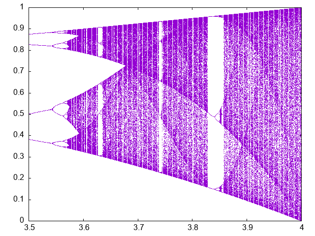

プログラムは[こちら](logistic/test.cpp)

## それぞれのaについての値

また、初期値をx=0.04で固定して、aごとの結果を出力した。横軸はステップ数、縦軸が得られた値である。それぞれの結果を直線で結んである。

また、それぞれの値についてリターンマップも示してある。横軸をx_n、縦軸をx_n+1として得られるグラフである。また、直線xとax(1-x)も同時に示した。100ステップ回した結果を示している。

なお、a=3.2以上では、その下にさらに20ステップを無視した上で、1000ステップ描写した結果を示している。
### a=0.8

この時、最終的には0に落ち着くことがわかる。

### a=1.6

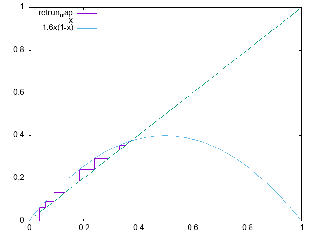

この場合は、ax(1-x)とxの交点に落ち着くことがわかる。

### a=2.4

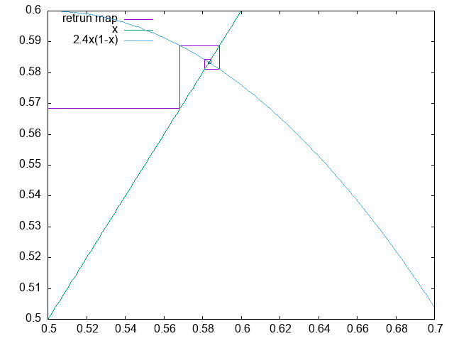

この場合も、ax(1-x)とxの交点に落ち着くことがわかる。

#### a=3.2

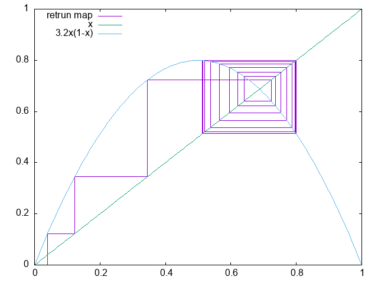
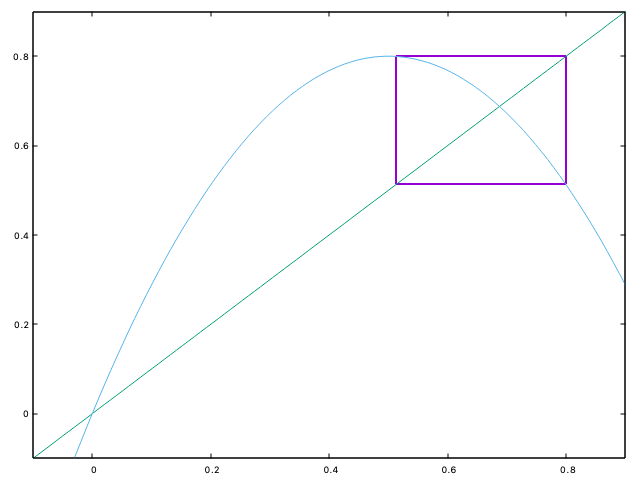

この場合は二周期になっていることが分かる。

#### a=3.6

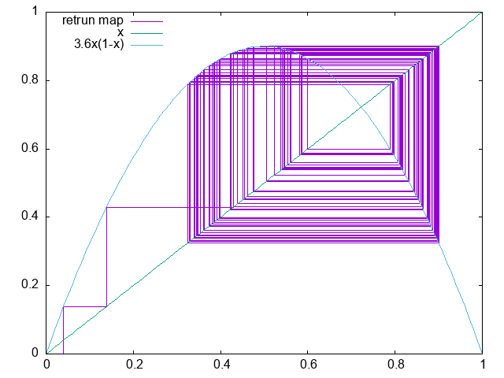
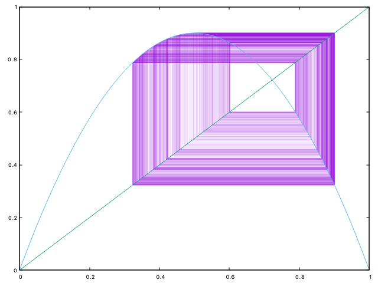

カオス的な性質があらわれている。

#### a=3.8

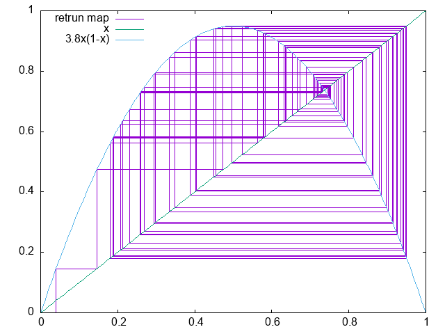
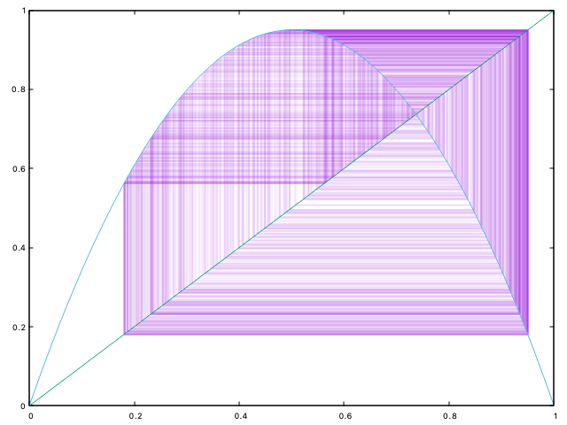

カオス的な性質があらわれていることがわかる。先ほどよりも覆われている面積が多い。
#### a=4.0

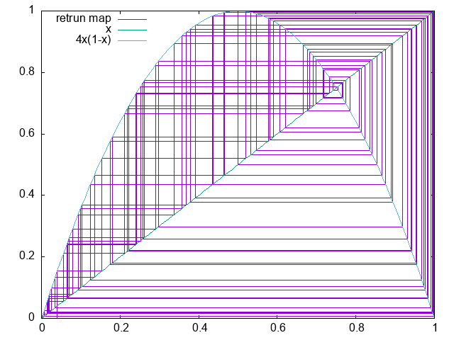
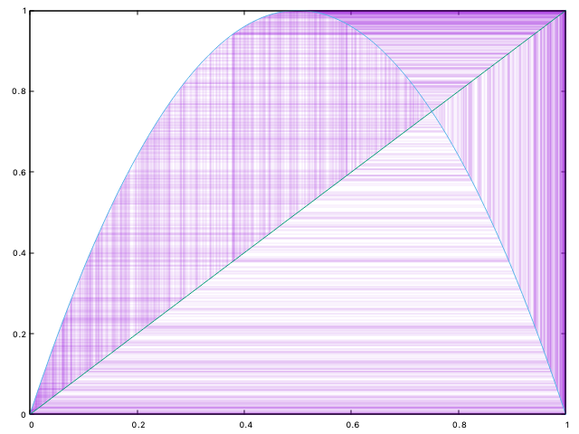
カオス的性質があらわれている。先ほど覆われている面積が多い。

変化グラフのプログラムは[こちら](logistic/test2.cpp)

リターンマップのプログラムは[こちら](logistic/return_map2/return_map.cpp)
